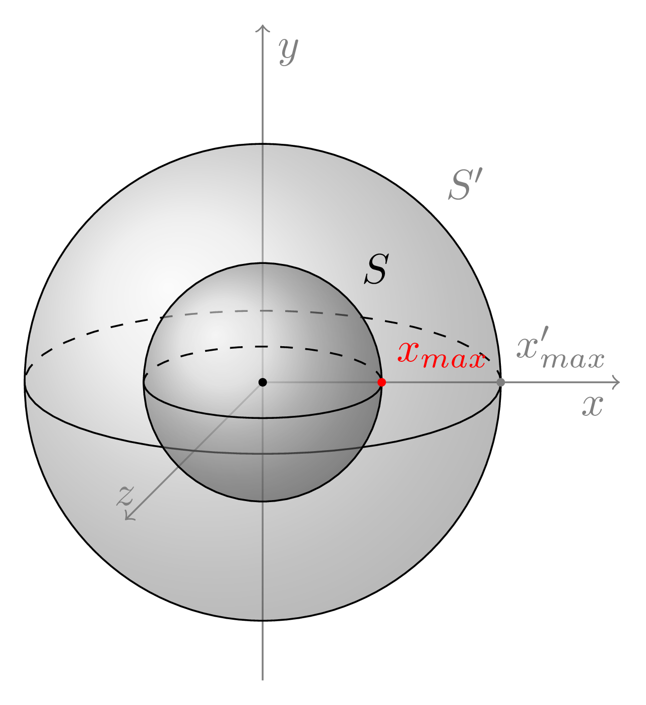

# Ansys Stress Propagation Analysis Tool

This code allows you to spacially map out stress boundaries using data from Ansys.

It is intended to be used for quickly finding the spacial extrema of different stress boundaries.



In the figure, the maximum x value, $x_{max}$, for the stress boundary $S$ is illustrated schematically.

This code allows you to find the exact maximum and minimum values of X, Y and Z for a given boundary without relying on the graphical user interface of Ansys.

## How the results look like

The resultant table will give the spatial (x,y,z) maxima and minima for a given user-specified sheer stress boundary.

In the example below, the user wants to examine the -2.8 MPa boundary.

The maximum X coordinate of a node that has a stress greater than -2.8 MPa (-2.8 MPa, +inf MPa) is 54.0 mm. On the other hand, the maximum X coordinate of a node that has a stress less than or equal to -2.8 MPa (-inf MPa, -2.8 MPa] is 39.788 mm.

```txt
┌────────────────────┬────────────┬────────────┬────────────┬────────────┬────────────┬────────────┐
│ Greater Than -2.8  ┆ Max X (mm) ┆ Min X (mm) ┆ Max Y (mm) ┆ Min Y (mm) ┆ Max Z (mm) ┆ Min Z (mm) │
│ (MPa)              ┆ ---        ┆ ---        ┆ ---        ┆ ---        ┆ ---        ┆ ---        │
│ ---                ┆ f64        ┆ f64        ┆ f64        ┆ f64        ┆ f64        ┆ f64        │
│ bool               ┆            ┆            ┆            ┆            ┆            ┆            │
╞════════════════════╪════════════╪════════════╪════════════╪════════════╪════════════╪════════════╡
│ true               ┆ 54.0       ┆ -46.0      ┆ 502.59     ┆ 89.0       ┆ 101.0      ┆ -101.0     │
│ false              ┆ 39.788     ┆ -32.59     ┆ 501.0      ┆ 356.08     ┆ 81.034     ┆ -81.295    │
└────────────────────┴────────────┴────────────┴────────────┴────────────┴────────────┴────────────┘
```

## How to run this code

Download the `ansys-stress-propagation` binary in the releases tab (or build the binary from source if you have Rust installed), and run the following command in the terminal. (Note: How the relevant output file is obtained from Ansys is outlined in the next section).

```sh
ansys-stress-propagation <stress boundary> <path/to/ansys/file.txt>
```

So if for example, if both the `ansys-stress-propagation` binary and the output data file (which I will call `ANSYS_SXY_file.txt`) are in the same directory, then if we want to investigate the 1.4 MPa stress boundary, we would simply run the following command in the terminal:

```sh
ansys-stress-propagation 1.4 ANSYS_SXY_file.txt
```

## Getting the data from Ansys

Follow the [guide from Ansys](https://ansyshelp.ansys.com/public/account/secured?returnurl=////Views/Secured/corp/v242/en/wb_sim/ds_exporting_results.html) on how to export the sheer stresses at different nodes along with the positional information of the nodes. This should give you a file named `ANSYS_SXY_file.txt`.

> Make sure the stresses, as well as the X, Y and Z coordinates are exported.

The first line of the exported `.txt` file should have the following headers.

```txt
Knotennummer	X-Position (mm)	Y-Position (mm)	Z-Position (mm)	Schubspannung (MPa)
```

> [!WARNING]  
> The code currently only works for German headers so far. Until the code is updated (PRs welcome), please change the headers in your file to their German equivalents.
>
> German <-> English Translations: Knotennummer = node ID, Schubspannung = Sheer Stress

## Citing This Software

If you use this software for your project, please cite the code with the following information.

```bib
@software{ansys_stress_propagation,
  author = {{Victor Steinborn}},
  title = {Ansys Stress Propagation Analysis Tool},
  url = {https://github.com/VSteinborn/ansys-stress-propagation},
  version = {0.1.0},
  date = {2025-03-04},
}
```
